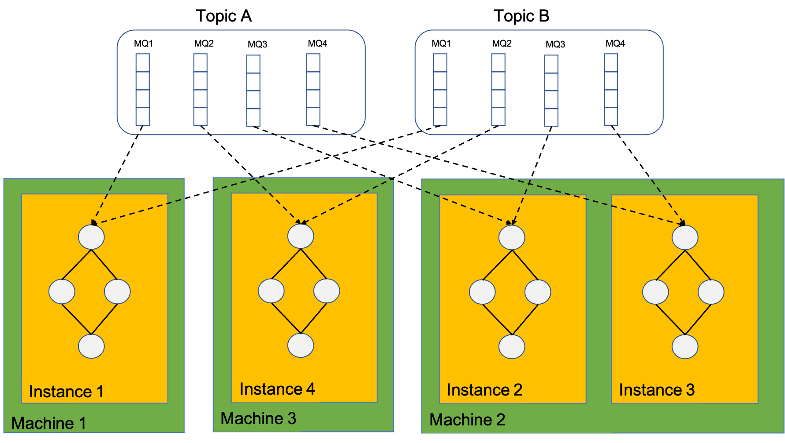
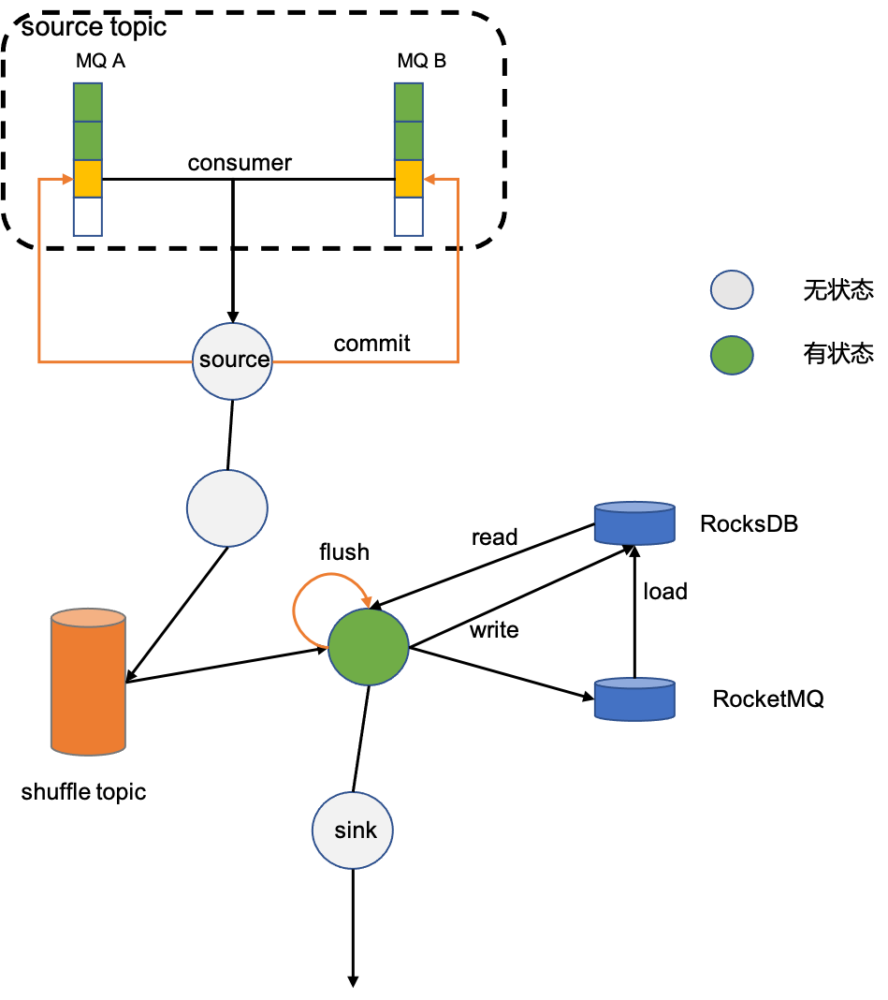
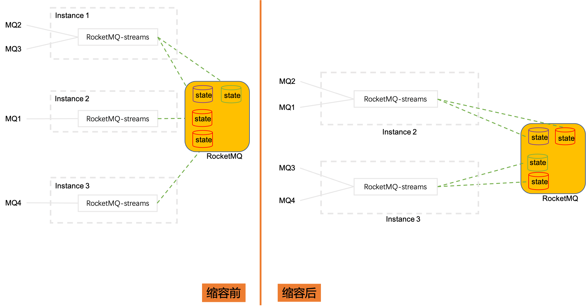

### 总体架构

数据从RocketMQ中被RocketMQ-streams消费，经过处理最终被写回到RocketMQ。
如果流处理任务中含有算子groupBy，则需要将数据按照Key进行分组，将分组数据写入shuffle topic。后续算子从
shuffle topic消费。如果还涉及count之类有状态算子，那么计算时需要读写状态，在窗口触发之后将计算结果写出。

### 消费模型

计算实例实质上是依赖了Rocket-streams SDK的client，因此，计算实例消费的MQ依赖RocketMQ rebalance分配，
计算实例总个数也不能大于消费总MQ个数，否则将有部分计算实例处于等待状态，消费不到数据。

一个计算实例可以消费多个MQ，一个实例内也只有一张计算拓扑图。

### 状态

对于有状态算子，他的状态本地依赖RocksDB加速读取，远程依赖RocketMQ做持久化。允许流计算任务时，可以只依赖本地存储
RocksDB, 只需要将setLocalStorageOnly设置成true即可。这种情况下可能存在状态丢失。

### 扩缩容

当计算实例从3个缩容到2个，借助于RocketMQ的rebalance，MQ会在计算实例之间重新分配。
Instance1上消费的MQ2和MQ3被分配到Instance2和Instance3上，这两个MQ的状态数据也需要迁移到Instance2
和Instance3上，这也暗示，状态数据是根据源数据分片保存的；扩容则是刚好相反的过程。
