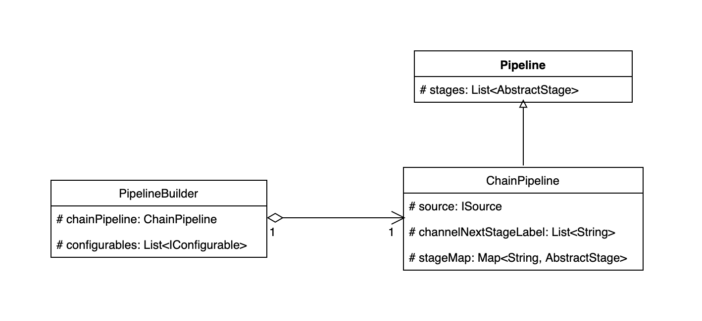

DataStreamSource中有一个PipelineBuilder，在后续构建过程中，这个PipelineBuilder会一直向后流传，
将构建过程中产生的source、stage添加进来；最后在start的时候，真正利用PipelineBuilder构建出拓扑图。

### source类型
 - 设置source的namespace、configureName;
 - 将source保存到PipelineBuilder中;
 - 将source作为source节点保存到PipelineBuilder中的ChainPipeline中;

### ChainStage类型

所有的其他运算，包括map,filter,script，window都会先构建出ChainStage，然后以ChainStage的身份进入
PipelineBuilder，参加后续构建。

在DataStream中一个典型的添加新算子，过程如下所示：
```java

public DataStream script(String script) {
     //将用户定义的cript转化成ChainStage
     // ChainStage<?> stage = this.mainPipelineBuilder.createStage(new ScriptOperator(script));
     //将ChainStage添加到PipelineBuilder中，构建拓扑。
     this.mainPipelineBuilder.setTopologyStages(currentChainStage, stage);
     //将PipelineBuilder构建成DataStream，向后传递，后续还可以用该PipelineBuilder构建拓扑
     return new DataStream(this.mainPipelineBuilder, this.otherPipelineBuilders, stage);
}

```

### 创建ChainStage

PipelineBuilder创建，创建过程中会设置label，并将这个ChainStage添加到PipelineBuilder持有ChainPipeline中

- 把ChainStage添加到pipeline中
  在构建过程中，所有的添加算子都使用一个共同的PipelineBuilder实例，PipelineBuilder结构如图所示，他持有
  一个ChainPipeline实例，ChainPipeline实例中含有一个ISource和多个stages，还有一个label与stage的映射关系，
  以及用于寻找下个stage的label。 
  
在createStage过程中，将chainStage加入到Pipeline中。
  
在setTopologyStages 过程中将label加入到Pipeline中；

### 设置拓扑
```java
public void setTopologyStages(ChainStage currentChainStage, List<ChainStage> nextStages) {
        if (isBreak) {
            return;
        }
        if (nextStages == null) {
            return;
        }
        List<String> lableNames = new ArrayList<>();
        for (ChainStage stage : nextStages) {
            lableNames.add(stage.getLabel());
        }

        if (currentChainStage == null) {
            this.pipeline.setChannelNextStageLabel(lableNames);
        } else {
            currentChainStage.setNextStageLabels(lableNames);
            for (ChainStage stage : nextStages) {
                stage.getPrevStageLabels().add(currentChainStage.getLabel());
            }
        }
    }
```

如果是首个ChainStage，则设置下一跳的label；如果不是首个，需要将下个stage的label设置进入当前stage。
同时，下个stage也需要设置前一个stage的label标签。形成双向链表的结构。


