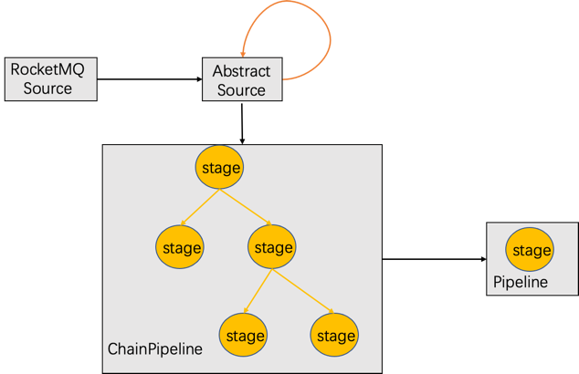
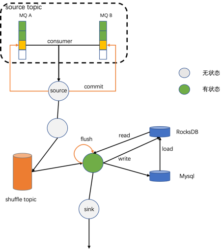

###总体过程

数据流转整体过程如图所示，黑色箭头线是数据流，橙色为控制流。数据的整体流向是从source中接收到，经过
AbstractSource判断是否发出系统消息，在进入ChainPipeline,ChainPipeline根据之间构建好的处理拓扑图，使用
深度优先策略找出下一个处理节点stage，交给Pipeline。Pipeline发现如果是系统消息则对stage执行特殊的控制逻辑，
如果不是，则用stage来处理具体数据。

### 无window算子执行流程
- source从RocketMQ中消费数据，进入RocketMQSource的父类AbstractSource；
- AbstractSource启动控制流，判断是否数据来自新分片，如果是，首先向下游传递一条NewSplitMessage消息，等待系
  统消息处理完成返回后，才能继续处理该数据。
- NewSplitMessage进入Pipeline，如果是系统消息，stage执行该类系统消息对应的控制操作。如果不是系统消息则用
stage处理数据；
- Pipeline执行完成后，返回到ChainPipeline，选择下一个stage继续执行；
- 遍历stage直到结束。  
  
### 含有window算子执行流程

- 数据流和控制流在上述流程一致，即先进入source，然后由AbstractSource判断是否发出发出系统消息，再进入
  ChainPipeline按照已经构建好的拓扑图执行。
- 不同的是，如果是window算子，那么这条数据在执行具体计算之前需要先按照groupBy分组，在执行算子，例如count。
分组操作需要借助于shuffle topic完成，即写入shuffle topic之前先按照groupBy的值，计算数据写入目的
  MessageQueue，相同groupBy值的数据将被写入一个MessageQueue中。这样shuffle数据被读取时，
  groupBy值相同的数据总会被一个client处理，达到按照groupBy分组处理的效果。
  
- ShuffleChannel会自动订阅、消费shuffle topic。数据会经过shuffle并在ShuffleChannel中再次被消费到。
- 判断是否是系统消息，如果是，执行该种类系统消息对应的控制流操作。
- 如果不是系统消息，触发window中算子计算，比如算子是count，就对某个key出现的次数加1；count算子用到的状
  态会在接收到NewSplitMessage类型系统消息时提前加载好。计算结束后的状态保存到RocksDB或者mysql中。

- window到时间后，将计算结果输出到下游stage继续计算，并清理RocksDB、Mysql中对应的状态。  

### 系统消息

#### NewSplitMessage
当发现数据来自新分片（MessageQueue）时，由AbstractSource产生并向下游拓扑传递。

作用于window算子，使其提前加载该分片对应的状态数据到内存，使得状态数据对该分片数据进行计算时，能使用
到对应的状态，得出正确的结果。

#### CheckPointMessage

##### 产生时机：
- 消费分片移除时；
- RocketMQ-streams向broker提交消费offset时；
- 处理完一批次消息后；

##### 作用
- 作用于各个缓存，例如将数据写入shuffle topic之前的WindowCache，使缓存中数据写出到下游。
- 作用于sink，将sink中缓存而未写出的数据写出；
- 将有状态算子的状态flush到存储；

#### RemoveSplitMessage
比较RocketMQ client触发rebalance前后消费的分片，如果某个分片不在被消费，需要将该分片移除，在移除该分配时发出
RemoveSplitMessage类型消息。

作用于window算子，将RocksDB中状态清除；

